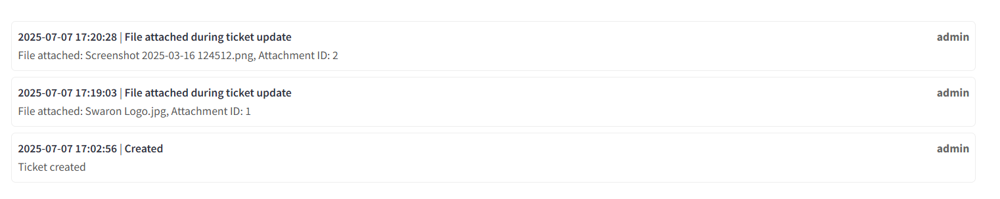

# CRM Ticket Management System - User Manual

## Table of Contents
1. [Getting Started](#getting-started)
2. [User Roles and Permissions](#user-roles-and-permissions)
3. [Creating Your First Ticket](#creating-your-first-ticket)
4. [Managing Tickets](#managing-tickets)
5. [File Attachments](#file-attachments)
6. [Comments and Communication](#comments-and-communication)
7. [Dashboard and Analytics](#dashboard-and-analytics)
8. [Advanced Features](#advanced-features)
9. [Troubleshooting](#troubleshooting)
10. [Best Practices](#best-practices)

---

## Getting Started

### System Requirements
- Web browser (Chrome, Firefox, Safari, Edge)
- Internet connection
- Login credentials provided by your system administrator

### Accessing the System
1. Open your web browser
2. Navigate to the CRM system URL provided by your administrator
3. Enter your username and password
4. Click "Login" to access the system


### Main Interface Overview
Once logged in, you'll see the main dashboard with:
- Navigation menu on the left
- Ticket list in the center
- Action buttons at the top
- Status tabs for organization


---

## User Roles and Permissions

### 1. Regular Users (Ticket Creators)
**What you can do:**
- Create new tickets
- Edit your own tickets (limited fields)
- Add comments to tickets
- Attach files to your tickets
- View ticket history and logs

**What you cannot do:**
- Edit operational remarks
- Change ticket status
- Assign tickets to agents
- Access other users' tickets

### 2. Agents
**What you can do:**
- All regular user permissions
- Edit operational remarks
- Change ticket status (Open, Pending, Closed, Resolved)
- View "My Tickets" dashboard
- Access assigned tickets
- Manage ticket workflows

**What you cannot do:**
- Delete tickets
- Access admin settings
- Modify system configurations


---

## Creating Your First Ticket

### Step-by-Step Guide

#### Step 1: Access Ticket Creation
1. Click the **"➕ Create New Ticket"** button on the main page
2. You'll be redirected to the ticket creation form


#### Step 2: Fill Required Information

**Basic Information:**
- **Order Number**: Enter the order number related to your query
  - Example: `600000963214`
- **QC ON/OFF**: Select whether quality check is required
- **Priority**: Choose from Low, Medium, or High
  - Use High for urgent issues affecting operations
  - Use Medium for standard requests
  - Use Low for general inquiries


#### Step 3: Query Details
- **Query Source**: Select where the query originated
  - Options: Email, Phone, Chat, Portal, etc.
- **Agent**: System will auto-select based on your login
- **Query Type**: Choose the category of your issue
  - Examples: Technical Issue, Billing, Order Related, General Inquiry


#### Step 4: Detailed Description
- **Reason**: Select specific reason based on query type
  - This field updates automatically based on Query Type selection
- **Sub Reason**: Choose more specific details
  - Also updates based on previous selections
- **Customer Comment**: Describe your issue in detail
  - Be specific about what happened, when, and any error messages
- **Remark**: Add any additional notes or context

**Example Customer Comment:**
```
Unable to access order tracking page. When I click on "Track Order" 
button for order #600000963214, the page shows "Error 404 - Page Not Found". 
This started happening since yesterday around 3 PM. I tried clearing 
browser cache and using different browsers but the issue persists.
```


#### Step 5: File Attachments (Optional)
- Click **"📎 Attach File"** to upload supporting documents
- Supported formats: PDF, JPG, JPEG, PNG, MP4, MKV, MP3
- Maximum file size: As configured by your administrator
- You can attach screenshots, error logs, or relevant documents


#### Step 6: Submit Ticket
1. Review all information for accuracy
2. Click **"✅ Submit Ticket"**
3. You'll see a success message with your ticket number
4. You'll be redirected to the ticket list


### Duplicate Prevention
If you try to create a ticket for an order that already has an open or pending ticket:
- System will show a warning message
- You'll see the existing ticket details
- Option to view the existing ticket instead


---

## Managing Tickets

### Viewing Ticket List

#### Main Ticket View
The ticket list is organized into tabs by status:
- **My Tickets** (Agents only): Your assigned tickets
- **Open**: Newly created tickets awaiting action
- **Pending**: Tickets waiting for additional information
- **Closed**: Completed tickets
- **Resolved**: Successfully resolved tickets


#### Ticket Information Displayed
Each ticket row shows:
- Ticket Number (unique identifier)
- Order Number
- Creator (who created the ticket)
- Query Type
- Reason
- Priority (color-coded)
- Status
- Creation Date
- Action button (View)


### Searching Tickets
1. Use the search box in the top-right corner
2. Search by:
   - Ticket number (e.g., "123")
   - Order number (e.g., "ORD-2024-001234")
3. Search is case-insensitive and supports partial matches

### Viewing Ticket Details

#### Accessing Ticket Details
1. Click **"View"** button next to any ticket
2. You'll see the complete ticket information page


#### Ticket Details Page Layout
The ticket details page contains:
- **Header**: Ticket number and creation date
- **Ticket Information**: All fields in organized sections
- **Comments Section**: Add new comments
- **Attachments**: View and download files
- **Activity Logs**: Complete history of changes


### Editing Tickets

#### Fields You Can Edit (as ticket creator):
- Order Number
- QC ON/OFF
- Priority
- Query Source
- Agent Assignment
- Query Type, Reason, Sub Reason
- Customer Comment
- Remark

#### Fields Only Agents Can Edit:
- Operational Remark
- Status
- Agent-specific attachments


#### How to Edit:
1. Make changes to any editable field
2. Click **"💾 Update Ticket"**
3. System will log all changes made
4. You'll see a success confirmation

---

## File Attachments

### Uploading Files

#### Supported File Types:
- **Documents**: PDF
- **Images**: JPG, JPEG, PNG
- **Videos**: MP4, MKV
- **Audio**: MP3

#### Upload Process:
1. Click **"📎 Attach File"** button
2. Select file from your computer
3. File uploads automatically when selected
4. You'll see upload confirmation


#### File Size Limits:
- Check with your administrator for size limits
- Large files may take longer to upload
- System will show error if file is too large

### Viewing Attachments

#### Attachment List:
- All attachments are listed in the "📎 Attachments" section
- Shows file name, size, upload date, and uploader
- Each file has a preview and download option


#### File Preview:
Click on any attachment to preview:
- **Images**: Display inline
- **PDFs**: Open in embedded viewer
- **Videos**: Play with built-in player
- **Audio**: Play with audio controls
- **Other files**: Download only


### Downloading Files
1. Click **"Download"** button next to any attachment
2. File will download to your default download folder
3. Original filename is preserved

---

## Comments and Communication

### Adding Comments

#### Comment Box:
- Located above the activity logs
- Type your message in the text box
- Click **"Send"** to post the comment


#### Comment with Attachments:
1. Type your comment
2. Attach a file using the file uploader
3. Click **"Send"** to post both comment and file
4. File attachment will be noted in the comment


#### Example Comments:
```
"I've tried the suggested solution but the issue persists. 
Attaching a screenshot of the error message I'm seeing."

"The order has been processed successfully. Closing this ticket."

"Need additional information from customer regarding delivery address."
```

### Communication Best Practices

#### For Users:
- Be specific and detailed in your comments
- Include relevant information (error messages, steps taken)
- Respond promptly to agent requests
- Use professional language

#### For Agents:
- Acknowledge receipt of tickets promptly
- Provide clear status updates
- Ask specific questions when more information is needed
- Document resolution steps for future reference

### Activity Logs

#### What's Logged:
- Ticket creation
- Status changes
- Field modifications (with before/after values)
- Comments added
- File attachments
- User actions

#### Log Format:
Each log entry shows:
- Date and time
- Action performed
- User who performed the action
- Details of what changed



---

## Dashboard and Analytics

### Accessing the Dashboard
1. Navigate to the dashboard section
2. Or run the dashboard application separately
3. View comprehensive analytics and metrics


### Key Metrics

#### Main KPIs:
- **Total Tickets**: Overall ticket count
- **Open Tickets**: Currently active tickets
- **Pending Tickets**: Awaiting response
- **Closed/Resolved**: Completed tickets
- **Average Resolution Time**: Performance metric

### Visual Analytics

#### Charts Available:
1. **Status Distribution**: Pie chart of ticket statuses
2. **Priority Breakdown**: Bar chart of priorities
3. **Agent Workload**: Tickets per agent
4. **Query Sources**: Where tickets originate
5. **Daily Trends**: Ticket creation over time

### Agent Performance
- View individual agent statistics
- Resolution rates and times
- Workload distribution
- Performance trends


### Filtering Data
- **Date Range**: Select specific time periods
- **Status Filter**: Focus on specific statuses
- **Agent Filter**: View specific agent data
- **Real-time Updates**: Data refreshes automatically


---

## Advanced Features

### My Tickets (Agents Only)

#### Accessing My Tickets:
1. Click on **"My Tickets"** tab
2. View only tickets assigned to you
3. Sub-tabs for Open and Pending tickets


#### Benefits:
- Focus on your workload
- Quick access to active assignments
- Better task management
- Performance tracking

### Status Management (Agents Only)

#### Status Workflow:
1. **Open**: New ticket, needs attention
2. **Pending**: Waiting for customer response or external action
3. **Resolved**: Issue fixed, awaiting confirmation
4. **Closed**: Ticket completed and confirmed


#### Changing Status:
1. Select new status from dropdown
2. Add operational remark explaining the change
3. Click **"Update Ticket"**
4. Status change is logged automatically


### Operational Remarks (Agents Only)

#### Purpose:
- Document internal notes
- Record resolution steps
- Communicate between agents
- Track problem-solving process

#### Example Operational Remarks:
```
"Contacted customer via phone. Issue was due to browser cache. 
Instructed customer to clear cache and cookies. Issue resolved."

"Escalated to technical team for further investigation. 
Ticket ref: TECH-2024-001 created."

"Customer confirmed issue is resolved. Order processing normally."
```

---

## Troubleshooting

### Common Issues

#### Cannot Create Ticket
**Problem**: Submit button doesn't work
**Solutions**:
- Check all required fields are filled
- Ensure valid order number format
- Try refreshing the page
- Contact support if issue persists

#### File Upload Fails
**Problem**: File won't upload
**Solutions**:
- Check file size (must be under limit)
- Verify file type is supported
- Try a different browser
- Ensure stable internet connection


#### Cannot View Attachments
**Problem**: Files won't open or download
**Solutions**:
- Check browser popup settings
- Try different browser
- Clear browser cache
- Contact IT support

#### Search Not Working
**Problem**: Search returns no results
**Solutions**:
- Check spelling of search terms
- Try partial search (fewer characters)
- Verify you have permission to view tickets
- Use exact ticket or order numbers

### Browser Compatibility
**Recommended Browsers**:
- Chrome (latest version)
- Firefox (latest version)
- Safari (latest version)
- Edge (latest version)

**Not Recommended**:
- Internet Explorer
- Very old browser versions


### Performance Tips
- Close unused browser tabs
- Clear browser cache regularly
- Use wired internet connection for large file uploads
- Refresh page if it becomes slow

---

## Best Practices

### For Ticket Creation

#### DO:
✅ Provide detailed descriptions
✅ Include relevant order numbers
✅ Attach supporting files
✅ Select appropriate priority
✅ Use clear, professional language
✅ Check for existing tickets first

#### DON'T:
❌ Create duplicate tickets
❌ Use ALL CAPS
❌ Include sensitive personal information
❌ Submit test tickets
❌ Use inappropriate language


### For Communication

#### Effective Comments:
- Start with a clear statement of purpose
- Include specific details and steps
- Use bullet points for multiple items
- End with clear next steps or questions

#### Example Structure:
```
PURPOSE: Providing update on order issue

DETAILS:
- Checked order status in system
- Confirmed payment processed successfully
- Identified shipping delay due to weather

NEXT STEPS:
- Contacted shipping carrier for update
- Will provide tracking number within 24 hours
- Customer will be notified of any delays
```

#### File Organization:
- One file per issue/topic
- Keep file sizes reasonable
- Use appropriate file formats
- Include context in comments when attaching

### For Agents

#### Ticket Handling:
1. **Acknowledge** new tickets within 1 hour
2. **Investigate** thoroughly before responding
3. **Communicate** clearly with customers
4. **Document** all actions taken
5. **Follow up** to ensure resolution

#### Status Updates:
- Update status promptly when circumstances change
- Add operational remarks explaining status changes
- Keep customers informed of progress
- Close tickets only after customer confirmation

---

### Important Buttons
- **➕ Create New Ticket**: Start new ticket
- **💾 Update Ticket**: Save changes
- **🔄 Refresh Data**: Update dashboard
- **📎 Attach File**: Upload files
- **⬅️ Back**: Return to previous page

---

*This manual was created for the CRM Ticket Management System developed by Anil. For additional support or questions not covered in this manual, please contact your system administrator.*

**Last Updated**: July 2025
**Version**: 1.0
